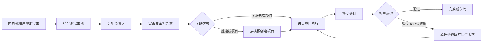

# 企业项目管理平台

面向 500 人以上企业的项目管理平台需求文档基线。系统聚焦内部项目、临时任务及客户参与的需求交付场景，解决项目进度不透明和跨部门协作困难的问题。

## 文档导航

1. [产品需求文档（PRD）](docs/01-PRD.md)
2. [MVP 与版本规划](docs/02-MVP与版本规划.md)
3. [角色权限矩阵](docs/03-角色权限矩阵.md)
4. [业务流程](docs/04-业务流程.md)
5. [功能模块与页面结构](docs/05-功能模块与页面结构.md)
6. [核心数据模型](docs/06-核心数据模型.md)
7. [待确认事项与默认假设](docs/07-待确认事项.md)
8. [部署、备份与恢复](docs/08-部署备份与恢复.md)
9. [需求追溯与验收矩阵](docs/09-需求追溯与验收矩阵.md)

## 当前状态

- 文档版本：`v0.1`
- 软件版本：`0.1.0 MVP`
- 状态：第一版核心链路可运行
- 目标终端：Web、移动端、桌面端
- 部署模式：企业私有化部署
- 语言：中文、英文

## 第一版实现范围

- Java 21 + Spring Boot 4.1 模块化后端
- Vue 3 + TypeScript + Vite 响应式 Web 前端
- MySQL 8.4 数据库与 Flyway 迁移
- 基于 Session、CSRF 和 BCrypt 的账号登录
- 多角色账号、管理员创建账号
- 部门层级、部门负责人视图与本部门成员/任务隔离
- 项目、里程碑、任务和基础看板
- 需求提交、待分派需求池和需求状态
- 需求分派、关联项目、提交审批、管理员批准/驳回及批准后创建项目
- 项目经理/成员/客户的基础数据范围控制
- 任务状态推进、完成工时和交付版本记录
- 客户验收通过、驳回、要求修改及验收意见留存
- 关键账号、组织、需求、项目、任务和验收操作审计
- 按项目类型独立配置任务状态迁移、角色权限和顺序审批步骤
- 审批提交、逐级通过、驳回、撤回、重新提交、意见与历史记录
- 站内消息及邮件、企业微信、Teams 实际投递、失败重试和投递状态
- 任务逾期按 12 小时逐级催办，且不自动改变任务或验收状态
- 项目预算、人工成本、其他费用和预算使用率
- 风险等级、负责人、状态、高风险通知和处理记录
- 项目文档客户授权、本地或 HTTP 外部存储适配器和不可覆盖的版本历史
- 工作日历、节假日/调休日及成员每日可用工时覆盖
- 成员可用工时、预计分配、实际工时、负荷率与排期冲突分析
- 项目任务只读甘特图，直观展示计划跨度与完成状态
- 支持项目类型、项目、部门、负责人、客户和日期范围筛选的数据报表
- 完成率、逾期率、里程碑达成率、部门负荷、成员工时、风险分布与客户验收效率指标
- 管理员项目、任务、需求合并预览，展示迁移范围和逐字段冲突
- 合并关联内容、工时、交付版本和审批记录，保留只读来源、目标映射与审计记录
- 可选 OIDC 企业统一身份登录，且只允许映射到预先创建并启用的本地账号
- 中文、英文全局切换，语言偏好保存在当前浏览器
- Docker Compose 私有化本地运行

后续节点继续实现：高级流程可视化设计、更多企业文件协议适配器以及移动端/桌面端专项体验。

## 快速启动

确保 Docker Desktop 已启动，然后在项目根目录运行：

```bash
docker compose up --build
```

访问 `http://localhost:5173`。

开发环境默认管理员：

- 账号：`admin`
- 密码：`Admin@123456`

首次用于真实环境部署前，必须通过环境变量修改初始密码，并关闭或限制默认管理员初始化。

## 本地开发

后端：

```bash
cd backend
mvn spring-boot:run
```

前端：

```bash
cd frontend
npm install
npm run dev
```

测试与构建：

```bash
cd backend && mvn test
cd frontend && npm run build
```

## 企业集成配置

所有密钥均通过部署环境变量注入，不应写入仓库。未启用的外部渠道不会影响站内消息，待投递记录会保留以便配置完成后继续发送。

邮件通知：

```bash
EMAIL_ENABLED=true
EMAIL_FROM=pm@example.com
SMTP_HOST=smtp.example.com
SMTP_PORT=587
SMTP_USERNAME=pm@example.com
SMTP_PASSWORD=change-me
SMTP_AUTH=true
SMTP_STARTTLS=true
```

企业微信和 Teams 使用机器人 Webhook：

```bash
WECHAT_WEBHOOK_URL=https://qyapi.weixin.qq.com/cgi-bin/webhook/send?key=...
TEAMS_WEBHOOK_URL=https://example.webhook.office.com/...
```

OIDC 单点登录默认注册名为 `corporate`。系统不会自动创建用户，管理员须先创建与身份提供方用户名声明一致的启用账号：

```bash
SSO_ENABLED=true
SSO_REGISTRATION_ID=corporate
SSO_USERNAME_CLAIM=preferred_username
SPRING_SECURITY_OAUTH2_CLIENT_REGISTRATION_CORPORATE_CLIENT_ID=...
SPRING_SECURITY_OAUTH2_CLIENT_REGISTRATION_CORPORATE_CLIENT_SECRET=...
SPRING_SECURITY_OAUTH2_CLIENT_REGISTRATION_CORPORATE_SCOPE=openid,profile,email
SPRING_SECURITY_OAUTH2_CLIENT_PROVIDER_CORPORATE_ISSUER_URI=https://id.example.com/...
```

文件默认写入 `FILE_STORAGE_PATH`。如企业文件服务支持以文件键为路径的原始 HTTP `PUT`/`GET`，可切换外部存储：

```bash
FILE_STORAGE_TYPE=http
FILE_STORAGE_HTTP_BASE_URL=https://files.example.com/project-management
FILE_STORAGE_HTTP_BEARER_TOKEN=...
```

外部存储键只允许字母、数字、点、下划线和连字符；服务应对 `PUT {base-url}/{key}` 返回 2xx，并通过同一路径的 `GET` 返回原始文件内容。

邮件网关或企业微信应用可调用外部需求接入 API。提交用户名必须对应管理员预先创建并启用的本地账号：

```bash
INTAKE_ENABLED=true
INTAKE_TOKEN=replace-with-a-long-random-token

curl -X POST https://pm.example.com/api/intake/EMAIL \
  -H 'Content-Type: application/json' \
  -H 'X-Intake-Token: replace-with-a-long-random-token' \
  -d '{"username":"customer-a","title":"邮件主题","description":"邮件正文","priority":"MEDIUM","projectType":"INTERNAL"}'
```

`WECHAT` 使用相同请求结构。登录失败限制可通过 `LOGIN_MAX_FAILURES`（默认 5）和 `LOGIN_LOCK_MINUTES`（默认 15）调整。

生产构建包含 PWA Manifest 与 Service Worker，可在支持的手机或桌面浏览器安装为独立窗口。复杂系统配置仍建议在桌面宽屏完成。

## 核心业务链路


