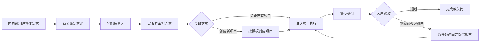

# 企业项目管理平台

面向 500 人以上企业的项目管理平台需求文档基线。系统聚焦内部项目、临时任务及客户参与的需求交付场景，解决项目进度不透明和跨部门协作困难的问题。

## 文档导航

1. [产品需求文档（PRD）](docs/01-PRD.md)
2. [MVP 与版本规划](docs/02-MVP与版本规划.md)
3. [角色权限矩阵](docs/03-角色权限矩阵.md)
4. [业务流程](docs/04-业务流程.md)
5. [功能模块与页面结构](docs/05-功能模块与页面结构.md)
6. [核心数据模型](docs/06-核心数据模型.md)
7. [待确认事项与默认假设](docs/07-待确认事项.md)

## 当前状态

- 文档版本：`v0.1`
- 软件版本：`0.1.0 MVP`
- 状态：第一版核心链路可运行
- 目标终端：Web、移动端、桌面端
- 部署模式：企业私有化部署
- 语言：中文、英文

## 第一版实现范围

- Java 21 + Spring Boot 4.1 模块化后端
- Vue 3 + TypeScript + Vite 响应式 Web 前端
- MySQL 8.4 数据库与 Flyway 迁移
- 基于 Session、CSRF 和 BCrypt 的账号登录
- 多角色账号、管理员创建账号
- 部门层级、部门负责人视图与本部门成员/任务隔离
- 项目、里程碑、任务和基础看板
- 需求提交、待分派需求池和需求状态
- 需求分派、关联项目、提交审批、管理员批准/驳回及批准后创建项目
- 项目经理/成员/客户的基础数据范围控制
- 任务状态推进、完成工时和交付版本记录
- 客户验收通过、驳回、要求修改及验收意见留存
- 关键账号、组织、需求、项目、任务和验收操作审计
- 按项目类型独立配置任务状态迁移、角色权限和顺序审批步骤
- 审批提交、逐级通过、驳回、撤回、重新提交、意见与历史记录
- 站内消息及邮件、企业微信、Teams 待投递队列
- 任务逾期按 12 小时逐级催办，且不自动改变任务或验收状态
- Docker Compose 私有化本地运行

后续节点继续实现：项目/任务/需求合并执行器、完整资源日历、外部渠道实际发送适配器、文档存储、甘特图和完整报表。

## 快速启动

确保 Docker Desktop 已启动，然后在项目根目录运行：

```bash
docker compose up --build
```

访问 `http://localhost:5173`。

开发环境默认管理员：

- 账号：`admin`
- 密码：`Admin@123456`

首次用于真实环境部署前，必须通过环境变量修改初始密码，并关闭或限制默认管理员初始化。

## 本地开发

后端：

```bash
cd backend
mvn spring-boot:run
```

前端：

```bash
cd frontend
npm install
npm run dev
```

测试与构建：

```bash
cd backend && mvn test
cd frontend && npm run build
```

## 核心业务链路


