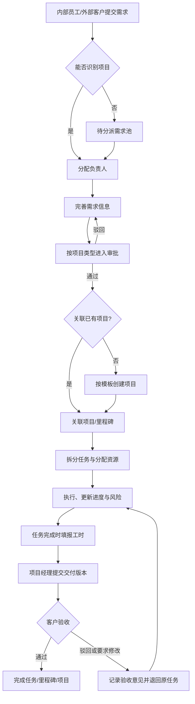
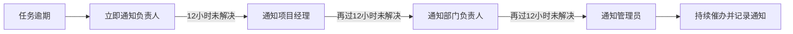
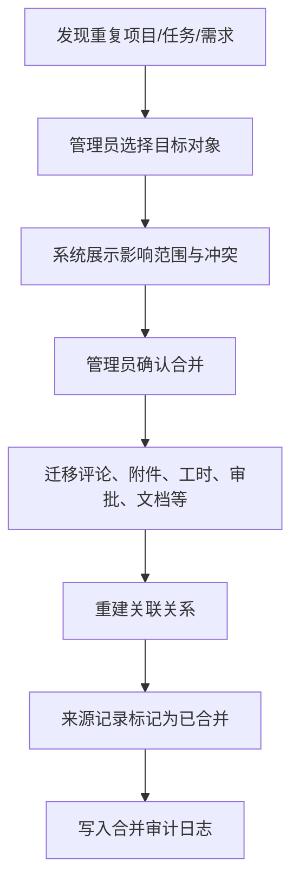
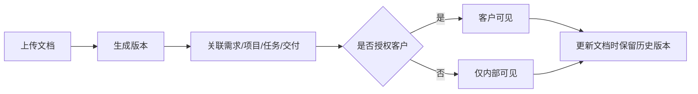
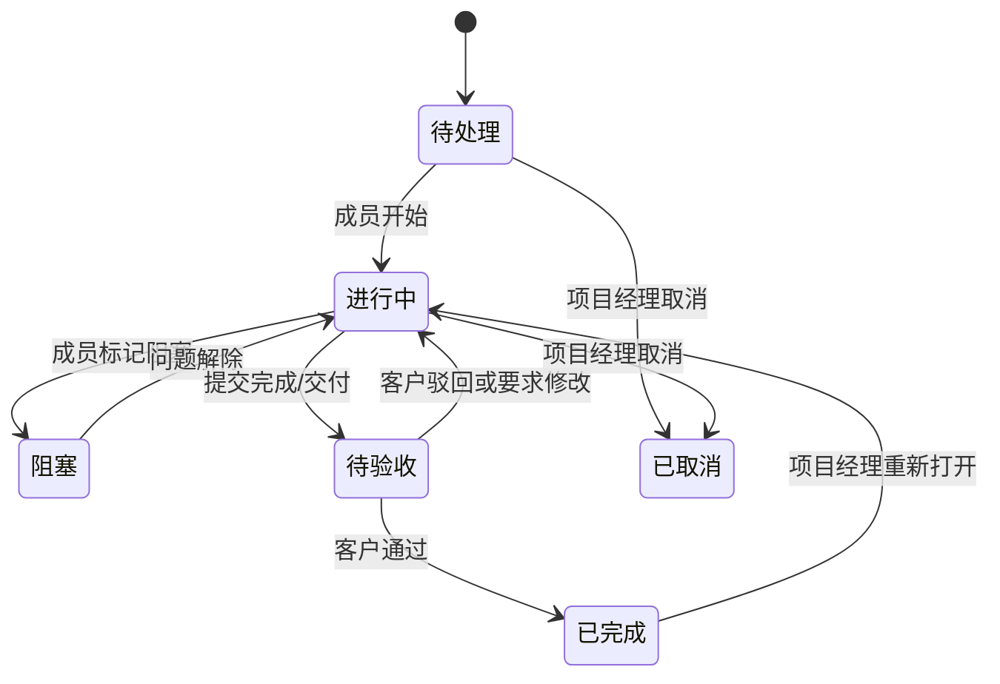

# 业务流程

## 1. 需求到交付主流程

```mermaid
flowchart TD
    A["内部员工/外部客户提交需求"] --> B{"能否识别项目"}
    B -->|否| C["待分派需求池"]
    B -->|是| D["分配负责人"]
    C --> D
    D --> E["完善需求信息"]
    E --> F["按项目类型进入审批"]
    F -->|驳回| E
    F -->|通过| G{"关联已有项目?"}
    G -->|是| H["关联项目/里程碑"]
    G -->|否| I["按模板创建项目"]
    I --> H
    H --> J["拆分任务与分配资源"]
    J --> K["执行、更新进度与风险"]
    K --> L["任务完成时填报工时"]
    L --> M["项目经理提交交付版本"]
    M --> N{"客户验收"}
    N -->|通过| O["完成任务/里程碑/项目"]
    N -->|驳回或要求修改| P["记录验收意见并退回原任务"]
    P --> K
```
## 2. 逾期升级流程

```mermaid
flowchart LR
    A["任务逾期"] --> B["立即通知负责人"]
    B -->|12小时未解决| C["通知项目经理"]
    C -->|再过12小时未解决| D["通知部门负责人"]
    D -->|再过12小时未解决| E["通知管理员"]
    E --> F["持续催办并记录通知"]
```

通知通过站内消息、邮件、企业微信或 Teams 按用户配置和事件规则发送。验收超期只催办，不自动通过。

## 3. 合并流程

```mermaid
flowchart TD
    A["发现重复项目/任务/需求"] --> B["管理员选择目标对象"]
    B --> C["系统展示影响范围与冲突"]
    C --> D["管理员确认合并"]
    D --> E["迁移评论、附件、工时、审批、文档等"]
    E --> F["重建关联关系"]
    F --> G["来源记录标记为已合并"]
    G --> H["写入合并审计日志"]
```

需要在详细设计阶段定义字段冲突、重复成员、重复工时、编号保留及撤销策略。

## 4. 文档版本流程

```mermaid
flowchart LR
    A["上传文档"] --> B["生成版本"]
    B --> C["关联需求/项目/任务/交付"]
    C --> D{"是否授权客户"}
    D -->|是| E["客户可见"]
    D -->|否| F["仅内部可见"]
    E --> G["更新文档时保留历史版本"]
    F --> G
```

## 5. 状态机（默认）

```mermaid
stateDiagram-v2
    [*] --> 待处理
    待处理 --> 进行中: 成员开始
    进行中 --> 阻塞: 成员标记阻塞
    阻塞 --> 进行中: 问题解除
    进行中 --> 待验收: 提交完成/交付
    待验收 --> 已完成: 客户通过
    待验收 --> 进行中: 客户驳回或要求修改
    待处理 --> 已取消: 项目经理取消
    进行中 --> 已取消: 项目经理取消
    已完成 --> 进行中: 项目经理重新打开
```
