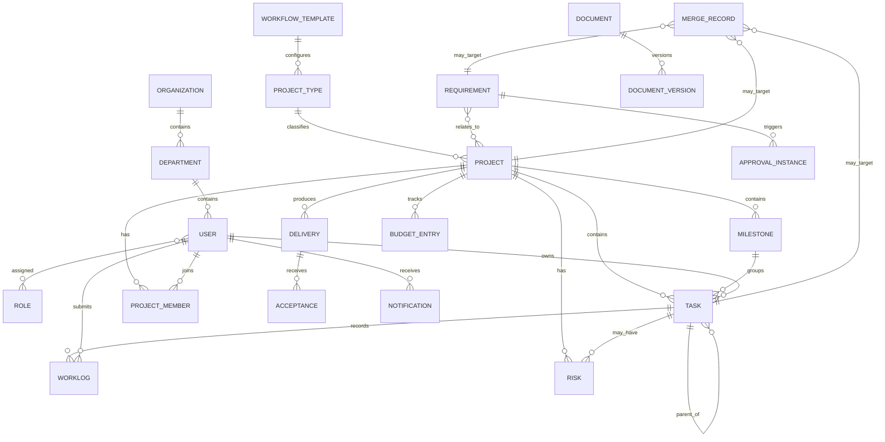

# 核心数据模型

## 1. 实体关系概览

## 2. 核心实体

### 2.1 用户与组织

| 实体 | 关键字段 |
|---|---|
| Organization | id、name、status |
| Department | id、organization_id、parent_id、name、manager_id |
| User | id、department_id、account、password_hash、name、email、language、status、user_type |
| Role | id、name、scope、status |
| UserRole | user_id、role_id、scope_object_id |

`user_type` 区分内部用户和外部客户。外部客户还需关联客户组织与可访问业务对象。

### 2.2 流程配置

| 实体 | 关键字段 |
|---|---|
| ProjectType | id、name_zh、name_en、status |
| WorkflowTemplate | id、project_type_id、version、status |
| WorkflowState | id、template_id、code、name、sequence |
| WorkflowTransition | id、from_state、to_state、allowed_role、condition |
| ApprovalInstance | id、business_type、business_id、template_version、status |
| ApprovalStep | id、instance_id、approver_id、sequence、result、comment、acted_at |

流程实例必须保存模板版本，避免模板更新改变历史审批含义。

### 2.3 需求、项目与任务

| 实体 | 关键字段 |
|---|---|
| Requirement | id、source、submitter_id、customer_id、title、description、status、assignee_id、project_type_id |
| Project | id、project_type_id、name、manager_id、status、planned_start、planned_end、actual_start、actual_end |
| RequirementProject | requirement_id、project_id、relation_type |
| Milestone | id、project_id、name、owner_id、planned_date、actual_date、status |
| Task | id、project_id、milestone_id、parent_task_id、title、owner_id、priority、status、planned_start_at、planned_end_at、actual_start_at、actual_end_at、estimated_hours |
| TaskParticipant | task_id、user_id、participant_role |
| ProjectMember | project_id、user_id、project_role、allocation_hours |

日期时间统一存储为 UTC，展示时按用户时区转换。

### 2.4 工时、资源与成本

| 实体 | 关键字段 |
|---|---|
| Worklog | id、task_id、user_id、hours、submitted_at、note |
| ResourceCapacity | id、user_id、date、available_hours |
| Budget | id、project_id、currency、total_amount、labor_budget、other_budget |
| BudgetEntry | id、project_id、type、amount、occurred_on、description、created_by |

预算使用率由预算与费用条目汇总计算，避免人工维护百分比导致不一致。

### 2.5 风险、文档和交付

| 实体 | 关键字段 |
|---|---|
| Risk | id、project_id、task_id、title、level、owner_id、status、description |
| Document | id、business_type、business_id、visibility、current_version_id |
| DocumentVersion | id、document_id、version_no、storage_key、file_name、size、uploaded_by、uploaded_at、note |
| Delivery | id、project_id、version_no、submitted_by、submitted_at、status |
| DeliveryItem | delivery_id、business_type、business_id |
| Acceptance | id、delivery_id、customer_user_id、result、comment、acted_at |

文档存储只保存 `storage_key`，实际文件由可替换的文件存储适配器管理。

### 2.6 通知、审计与合并

| 实体 | 关键字段 |
|---|---|
| Notification | id、recipient_id、channel、event_type、business_type、business_id、status、sent_at |
| Escalation | id、task_id、level、target_user_id、triggered_at、resolved_at |
| AuditLog | id、actor_id、action、business_type、business_id、before_data、after_data、created_at |
| MergeRecord | id、object_type、source_ids、target_id、operator_id、mapping_data、created_at、status |

合并不能只执行物理删除。`MergeRecord` 与只读来源记录用于追踪原编号、迁移关系及后续纠错。

## 3. 关键约束

1. 客户查询必须同时校验用户身份和业务对象关联。
2. 同一交付版本只能有一个最终验收结果，但允许保留多次操作记录。
3. 实际完成时间在任务进入已完成状态时生成；重新打开后保留历史状态记录。
4. 工时不可超过系统允许的单次和单日上限，具体阈值待配置。
5. 文档版本不可覆盖，只能生成新版本。
6. 预算和成本金额必须保存币种；多币种换算暂不纳入首期。
7. 所有状态变更通过状态迁移服务执行并写入审计日志。
